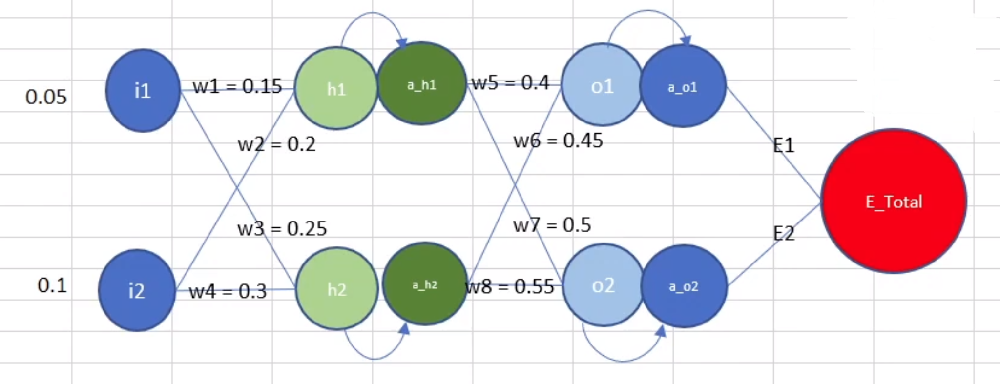
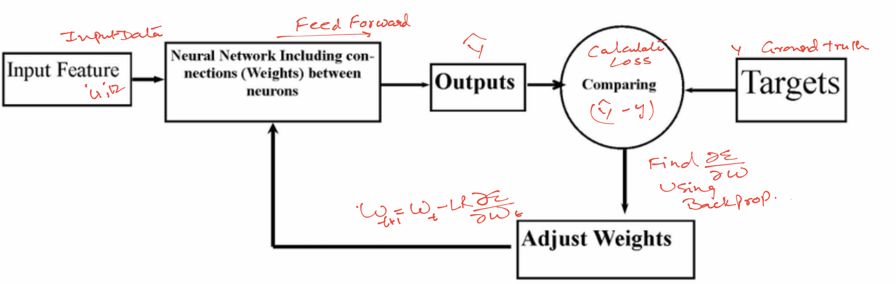
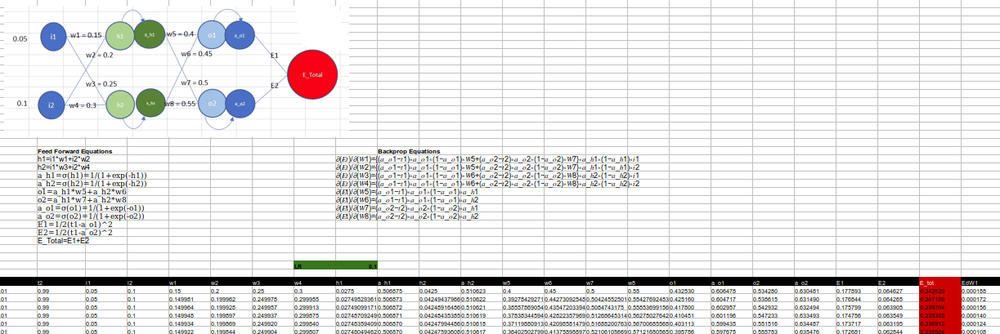
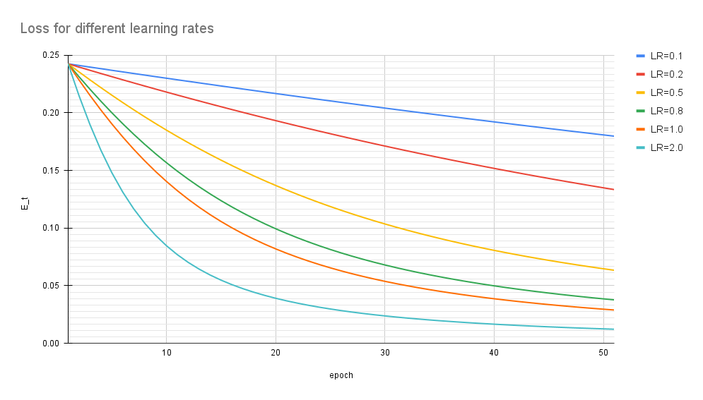

## Problem Statement
This is the assignment based on the Session 2. We are expected to train a network as shown below

Some of the details of what we have done: 

### Setup Steps
1. Initialize the weights of the parameters. In our case it is as shown in the above diagram

2. Make a input data set. The inout data will help in finding out how the network is predicting. With more and more input data the network should start learning (finding the optimal weights). In our case we have fixed the input data to 0.05 and 0.1

3. Make a ground truth data . This is the data against which the output of the network is tested. In our case the ground truth value is 0.01 & 0.99 for the input of 0.05 & 0.1. Since the inputs are fixed so are the ground truth values

  ### Training Steps
 The training will involve 3 steps. 
  * First we need to find out what is the current behavior of the network by passing a input set. This is the **feed forward step**. In the feedforward step , the values of the neurons is changed. The equations that determine the calculations is described in the document [FormulaDerivations.ipynb](https://github.com/TSAI-END3-Group/Session_2_Assignment/blob/master/FormulaDerivations.ipynb) .

  * Compare the output against the ground truth (what was the expected output). this is what is the Loss or the Error 

  * Calculate the change in the parameters w.r.t. the error or in other words,  adjust the weights of the parameters such that the overall error is reduced. The change is calculated using **backpropogation**. We have discussed the various equations that will be used in the document [FormulaDerivations.ipynb](https://github.com/TSAI-END3-Group/Session_2_Assignment/blob/master/FormulaDerivations.ipynb)

  __Note: In the FeedForward step the value of the neurons is changed while in the backprop step the value of the parameters is changed__

  * The updation  of the paramters is done using the general equation. 

    
  
    In this equation we can see the LR is hyperparameter that controls the updates to the parameter value. For the same error change higher values of LR will change the Paramter value more compared to the lower values of LR

  * We repeat the steps again and again till the time the Loss becomes very small or stop changing (minima has been reached).

    The above steps can be summarized in the below diagram.
    

## Outputs

1. Refer to the [Assignment_2_NN_Propogation.xlsx](https://github.com/TSAI-END3-Group/Session_2_Assignment/blob/master/Assignment_2_NN_Propogation.xlsx) for the excel sheet showing backprop calculations. 

Below is the screenshot of the Excel that has been created.
 

3. Refer to the [FormulaDerivations.ipynb](https://github.com/TSAI-END3-Group/Session_2_Assignment/blob/master/FormulaDerivations.ipynb) where we have explained the various formula derivations and how the learning happens

4. Below are the various error graphs that we got after using the various Learning rates as asked for [0.1, 0.2, 0.5, 0.8, 1.0, 2.0] 

### Error graphs 
For the various Learning Rates we see the error goes down differently. At the lowere LR the decrease in error is very slow and hence the learning is also slow. While for LR>=1 the error seem to go down very fast and that shows that the learning is fast at higher LR

Below are the error graphs obtained at different LRs

The above image is a comparison of effect of LR on the Loss.
Learning curve is on the the training dataset and gives an idea of how well the model is learning with each epoch

In the previous assignment we had discussed the effect of the LR on the network training (https://github.com/TSAI-END3-Group/Session_1_Assignment/blob/main/questions.ipynb) 

Some observations: 
1. The graph clearly shows that the learning was very slow when the LR was 0.1,0.2. The error was reducing very slowly with each epoch

2. The slope of the curve became steep once the LR >=1.0. Suggesting that the model is learning very fast. Infact the error became <0.05 within 20 epochs when the LR became 2 and after that the learnig was very slow

## Repository Files

1. [FormulaDerivations.ipynb](https://github.com/TSAI-END3-Group/Session_2_Assignment/blob/master/FormulaDerivations.ipynb) : All the mathematical derivations

2. [Assignment_2_NN_Propogation.xlsx](https://github.com/TSAI-END3-Group/Session_2_Assignment/blob/master/Assignment_2_NN_Propogation.xlsx) : The Excel Output file

## Contributors
* Rohit Agarwal
* Vivek Kumar
* Kushal Gandhi
* Ammishaddai U