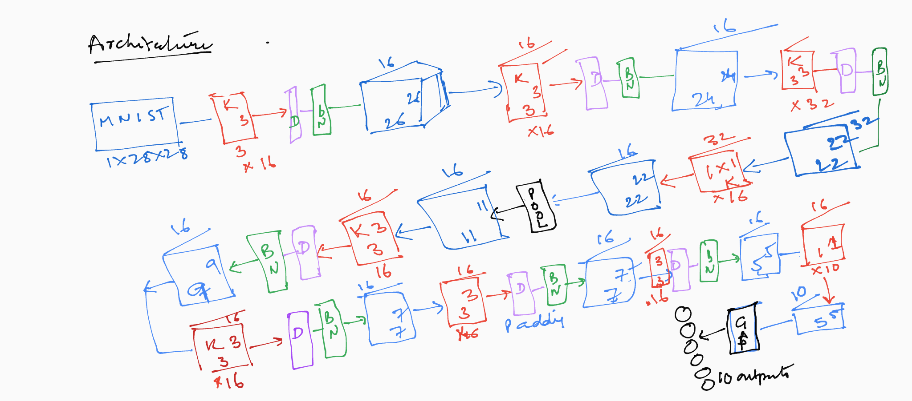
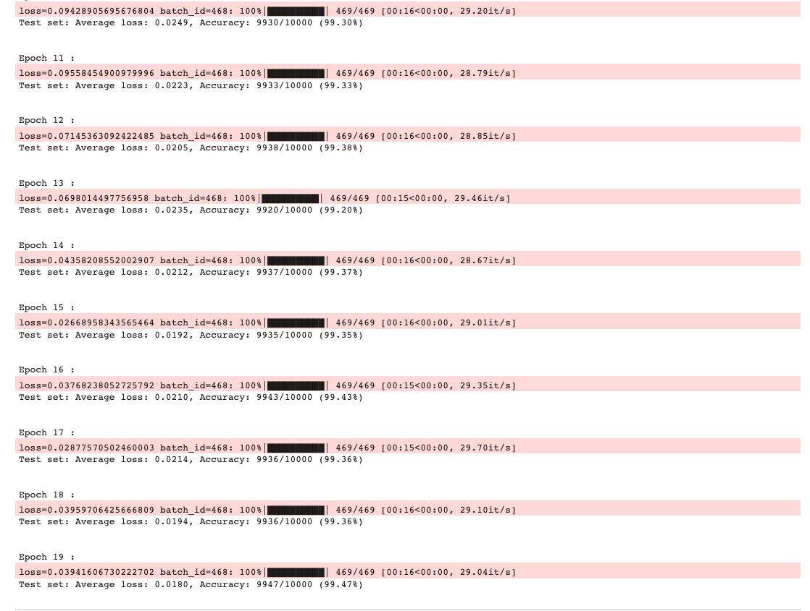

There are few rules to be followed in order to complete the assignment

1. Number of trainable parameters to be <20K
2. The validation accuracy >=99.4%
3. Number of epochs to reach the desired accuracy <20
4. Most important no use of FC layers

In order to keep the training parameters low some of the concepts that have been used:
1. **No bias parameters**: they unnecesarily increase the parameters . The biases are not useful and is an overhead in terms of parameters

2. Kept the number of channels less. Instead of going to 128 or 256 channels I am only going till 32 channels. mostly 16channels is what i have restricted to

3. The most important step to control the channel is the use of **1x1 kernel** which brings down the number of channels and hence the parameters

4. Use of **GAP** layer at the end where most of the traditional networks use linear layer drastically reduces the need for paramters. The step only add 160 parameters instead of million parameters like in case of VGG

### Here is the setup of the network

Basically there is a Kernel+Dropout+BatchNorm pattern that has been followed afeter every convolution

### Few salient points about the setup:

**Number of Paramters**: 17200

**Loss function**: NLL

**Batch Size**: 128

**Learning Rate**: 0.01

**Optimizer**: SGD

## Results
The best output is validation accuracy of 99.47 in the 19th epoch. Howerver 99.43% accuracy was hit in epoch 16

followign are the training dump

